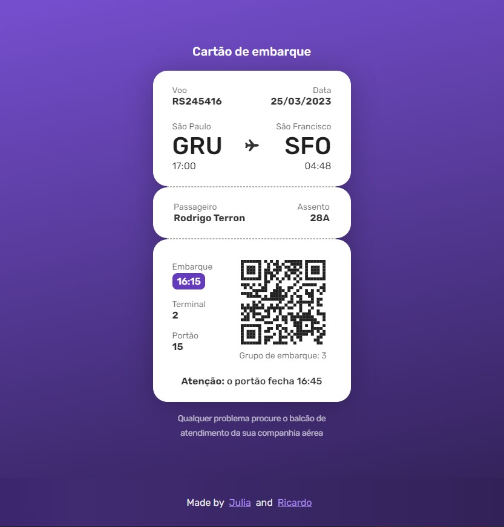

<h1 align="center"> #6 Boarding Pass </h1>

Esse projeto é o #6 desafio <a href="https://boracodar.dev/">#BORACODAR</a> da RocketSeat 

  <a href="#-tecnologias">Tecnologias</a>&nbsp;&nbsp;&nbsp;|&nbsp;&nbsp;&nbsp;
  <a href="#-projeto">Projeto</a>&nbsp;&nbsp;&nbsp;|&nbsp;&nbsp;&nbsp;
  <a href="#-layout">Layout</a>&nbsp;&nbsp;&nbsp;|&nbsp;&nbsp;&nbsp;
  <a href="#-collaborators">Collaborators</a>&nbsp;&nbsp;&nbsp;|&nbsp;&nbsp;&nbsp;

 

  

## 🚀 Tecnologias

Esse projeto foi desenvolvido com as seguintes tecnologias:

- HTML
- CSS
- JavaScript
- React
- Git e Github
- Figma

## 💻 Projeto

O projeto _Boarding Pass_ foi realizado como parte do desafio #BORACODAR da RocketSeat sugerido pelo professor <a href="https://github.com/maykbrito" alt="Link para o GitHub do professor Mayk Brito" target="_blank">Mayk Brito</a>.

- <a href="https://boarding-pass-rocketseat.vercel.app/" target="_blank">Visite o projeto online</a>

## 🔖 Layout

Você pode visualizar o layout proposto pela RocketSeat através do [LINK](https://www.figma.com/community/file/1205146101173113980). É necessário ter conta no [Figma](https://figma.com) para acessá-lo.

## 📃 Collaborators

This challange was made by [Julia](https://gsajulia.github.io) and [Ricardo](https://rickazuo.github.io/portfolio/)
