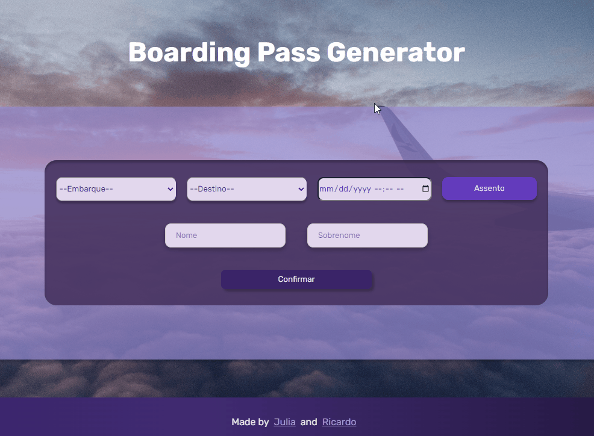
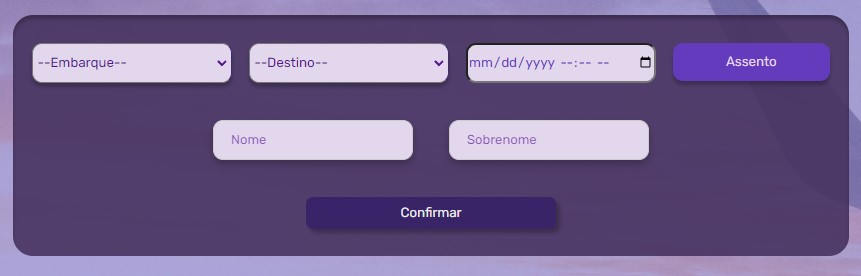
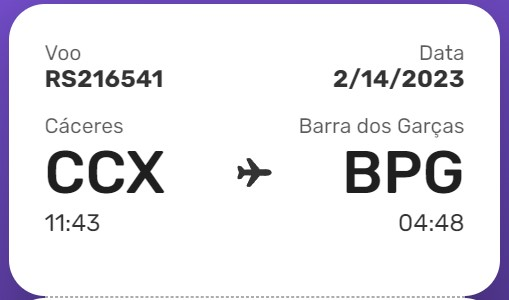
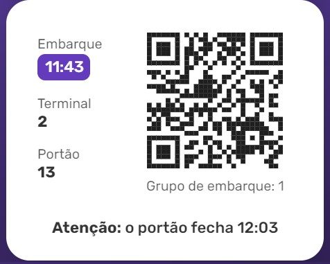

<h1 align="center"> #6 Boarding Pass </h1>

A criação de um boarding pass é o #6 desafio <a href="https://boracodar.dev/">#BORACODAR</a> da RocketSeat 

  <a href="#-tecnologias">Tecnologias</a>&nbsp;&nbsp;&nbsp;|&nbsp;&nbsp;&nbsp;
  <a href="#-projeto">Projeto</a>&nbsp;&nbsp;&nbsp;|&nbsp;&nbsp;&nbsp;
  <a href="#-layout">Layout</a>&nbsp;&nbsp;&nbsp;|&nbsp;&nbsp;&nbsp;
  <a href="#-collaborators">Collaborators</a>&nbsp;&nbsp;&nbsp;|&nbsp;&nbsp;&nbsp;

 

  

## 🚀 Tecnologias

Esse projeto foi desenvolvido com as seguintes tecnologias:

- HTML
- CSS
- JavaScript
- React
- Git e Github
- Figma

## 💻 Projeto

O projeto _Boarding Pass_ foi realizado como parte do #6 desafio #BORACODAR da RocketSeat sugerido pelo professor <a href="https://github.com/maykbrito" alt="Link para o GitHub do professor Mayk Brito" target="_blank">Mayk Brito</a>.

<h1 align="center">
  Funcionalidades
</h1>

O desafio inicial foi a criação de um cartão de embarque como o modelo mostrado em <a href="#-layout">Layout</a>, após a confecção do modelo, resolvemos então fazer com que os dados que o cartão de embarque possui fossem adquiridos em uma página prévia, através das escolhas do usuário.

<h2 align="center">
  Página Inicial
</h2>

A Página Inicial, foi desenha pensando nos dados necessários que precisavam ser obtidos para dar origem ao cartão de emabarque.

Então para que o cartão seja gerado é necessário que o usuário preencha todos os campos a fim do bom funcionamento do
aplicativo. 

Em ordem os campos são:

- **Embarque** (usuário escolhe de qual ciadade vai embarcar para a viagem)

- **Destino** (usuário escolhe qual cidade será o destino de sua viagem)

- **Data** (usuário poderá escolher a data e horário do seu voo)

- **Assento** (usuário escolhe qual assento utilizará durante a viagem, através de pop-up que aparecerá na tela simulando o corpo do avião)

- **Nome** (usuário preenche com o nome da pessoa que viajará)

- **Sobrenome** (usuário preenche com o sobrenome da pessoa que viajará)

- **Confirmar** (após o preenchimento de todos os campos o usuário dever apertar o botão <strong>_confirmar_</strong> para gerar o cartão de embarque)

  

<h2 align="center">
Cartão de Embarque
</h2>

O cartão de embarque pode ser divido em 3 partes:

<h3 align="center">Informações de Voo</h3>

- **Voo** - Campo gerado de forma aleatória

- **Data** - Campo gerado com a informação **_Data_** adquirida da Página Inicial

- **Cidade de Partida** - Campo gerado com a informação adquirida **_Embarque_** da Página Inicial

- **Cidade de Chegada** - Campo gerado com a informação adquirida **_Destino_** da Página Inicial

- **Código IATA de Partida** - Campo gerado com a informação adquirida **_Embarque_** da Página Inicial

- **Código IATA de Chegada** - Campo gerado com a informação adquirida **_Destino_** da Página Inicial

- **Horário de Partida** - Campo gerado com a informação adquirida **_Data_** da Página Inicial

- **Horário de Chegada** - Valor Fixado em "04:48"

  

<strong>Obs</strong> Os campos das cidades com aeroportos e seus respectivos código IATA estão atrelados a um arquivo chamado _airport.json_

<h3 align="center">Informações do Passageiro</h3>

- **Passageiro** - Campo gerado com a informação adquirida **_Nome_**, **_Sobrenome_**da Página Inicial

- **Assento** - Campo gerado com a informação adquirida **_Assento_** da Página Inicial

  

<h3 align="center">Informações de Embarque</h3>

- **Embarque** - Campo gerado com a informação adquirida **_Data_** da Página Inicial

- **Terminal** - Campo gerado de forma aleatória

- **Portão** - Campo gerado de forma aleatória

- **QRcode** - Campo fixado por um SVG do próprio layout fornecido

- **Grupo de Embarque** - Campo gerado de forma aleatória

- **Fechamento do Portão** - Campo gerado com a informação adquirida **_Data_** da Página Inicial e adicionado 20 minutos

  

_<h2 align="center" ><a href="https://boarding-pass-rocketseat.vercel.app/" target="_blank">Visite o projeto online</a></h2>_

## 🔖 Layout

Você pode visualizar o layout proposto pela RocketSeat através do [LINK](https://www.figma.com/community/file/1205146101173113980). É necessário ter conta no [Figma](https://figma.com) para acessá-lo.

## 📃 Collaborators

This challange was made by [Julia](https://gsajulia.github.io) and [Ricardo](https://rickazuo.github.io/portfolio/)
